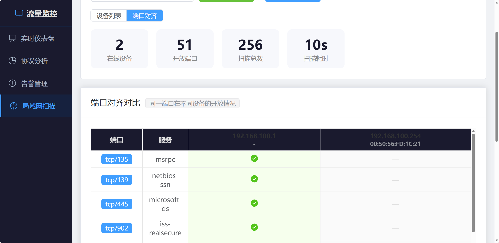
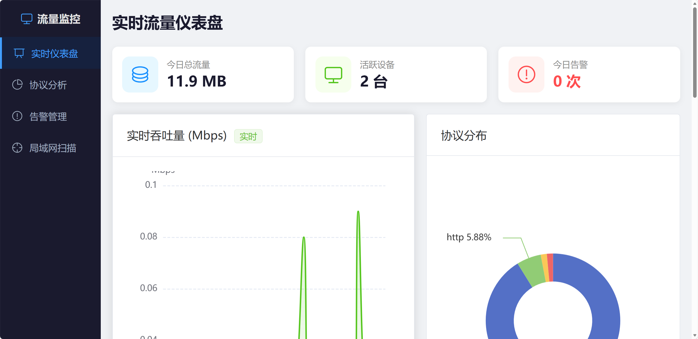
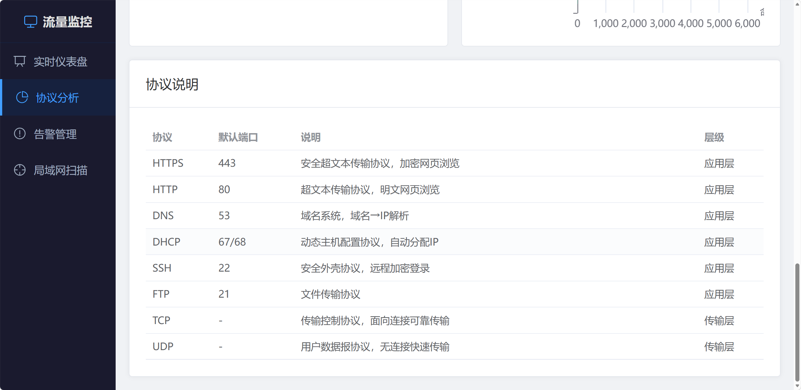
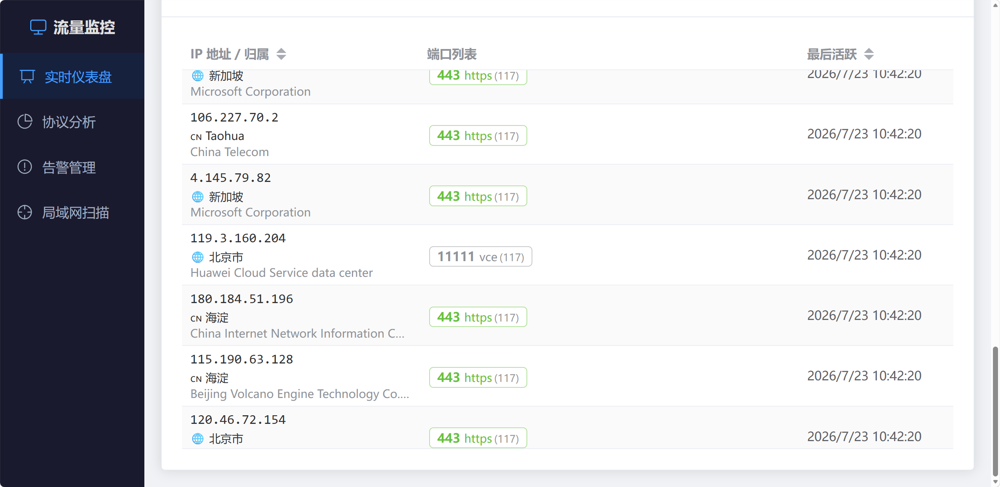
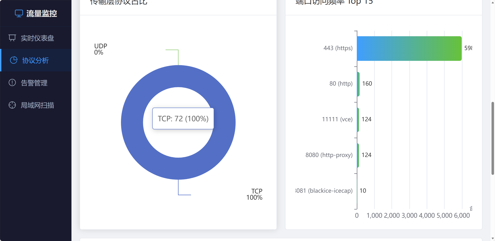
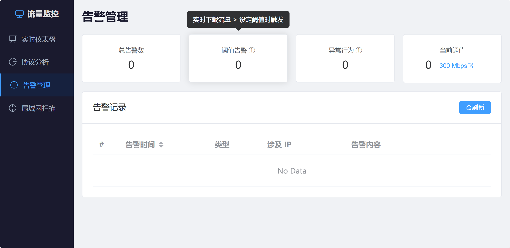
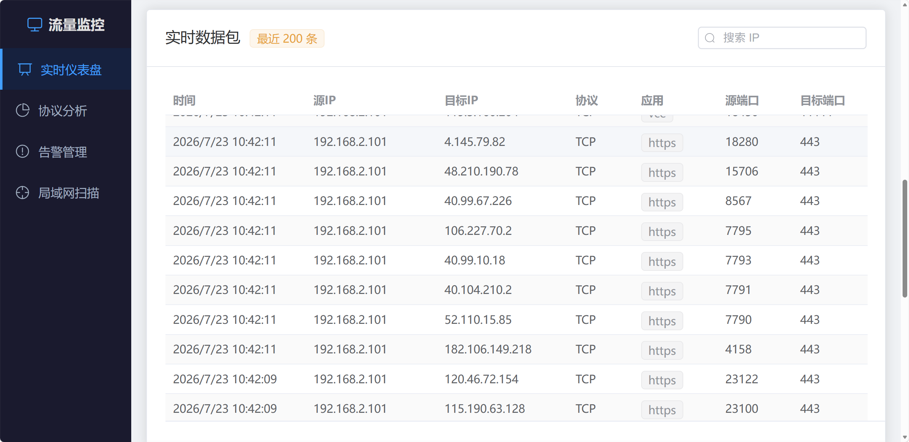
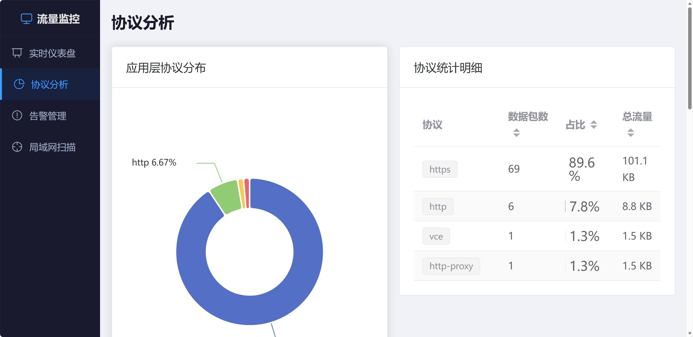

# 局域网流量监控与安全分析系统

基于 Vue 3 + Node.js + Nmap 的轻量级局域网流量实时监控工具，双击即可启动。

##  项目亮点

-  **全栈独立开发**：Vue 3 前端 + Node.js 后端 + WebSocket 实时通信
-  **数据可视化**：ECharts 5 实现 6 种图表（实时曲线、饼图、玫瑰图、柱状图、表格矩阵）
-  **网络协议分析**：集成 Nmap 引擎，解析 19919 条端口-服务映射
-  **实时性**：Windows 性能计数器 + netstat 秒级采集，WebSocket 双向推送
-  **安全检测**：自研流量阈值告警 + 端口扫描行为识别算法
-  **模块化架构**：前后端分离，后端 10 个模块职责清晰，前端 Pinia 状态管理

## 界面预览

### 1. 实时流量仪表盘（上）


> 顶部三张统计卡片分别展示**今日总流量**、**活跃设备数**、**今日告警次数**。左侧为网卡实时吞吐量曲线（绿色下载 / 蓝色上传，单位 Mbps），数据来源于 Windows Get-Counter 性能计数器。右侧为应用层协议分布饼图，基于 Nmap 19919 条端口服务数据库实时识别。

### 2. 实时流量仪表盘（下）


> 实时数据包表格展示当前网络中对外连接的五元组信息（时间、源IP、目标IP、协议、源端口、目标端口），支持按 IP 搜索过滤。下方 IP-端口映射表展示每个活跃 IP 的端口使用情况和归属地信息（通过 ip-api.com 自动查询公网 IP 的国家/城市/ISP），并标注局域网地址。

### 3. 协议分析（上）


> 左侧为应用层协议分布饼图，展示 HTTPS、HTTP、DNS、SSH、DHCP 等协议的实时占比。右侧为协议统计明细表，列出每种协议的数据包数、占比进度条和总流量估算。

### 4. 协议分析（下）


> 左侧传输层协议占比玫瑰图展示 **TCP / UDP** 真实连接数比例（数据来源于 netstat 实时统计，非硬编码）。右侧端口访问频率 Top 15 横向柱状图，按命中次数降序排列。底部为常见协议说明表（HTTPS 443、DNS 53、DHCP 67/68、SSH 22、FTP 21）。

### 5. 局域网扫描


> 调用 Nmap 对局域网进行主机发现（Ping 扫描）和端口扫描（500 端口高精度服务识别），展示每台设备的 **IP 地址、MAC 地址、主机名、操作系统** 及开放端口列表。右侧扫描日志实时输出 Nmap 原始扫描进度，底部汇总在线/离线主机数、开放端口总数等统计信息。

### 6. 端口对齐视图


> 将所有被扫描设备的开放端口横向对齐在同一张矩阵表中对比。每行是一个端口（协议/端口号/服务名），每列是一台设备，单元格显示端口状态（open/filtered）及服务版本信息。**一眼就能发现哪台设备开放了异常端口。**

### 7. 告警管理


> 支持自定义流量阈值（Mbps）和告警开关。内置**流量峰值检测**（超过阈值自动告警）和**异常行为检测**（连接数飙升 2.5 倍以上、单 IP 被访问 8 个以上不同端口则判定为端口扫描）。告警日志实时记录并支持浏览器弹窗提醒。

### 8. 设备端口详情


> 点击扫描结果中的任意设备，弹窗展示该设备的完整端口详情，包括端口号、协议（TCP/UDP）、服务名称、端口状态（open/filtered/closed）及服务版本号。

---

## 快速启动

```bash
# 1. 安装依赖
cd server && npm install
cd ../web && npm install

# 2. 启动后端（端口 3000 + WebSocket 3001）
cd ../server && node index.js

# 3. 开发模式启动前端（端口 5173）
cd ../web && npm run dev

# 4. 浏览器访问
# 开发模式: http://localhost:5173
# 生产模式: http://localhost:3000（需先 npm run build）
```

> 或直接双击根目录 `start.bat` 一键启动。

---

## 项目结构

```
lan-traffic-monitor/
├── server/                  # 后端 Node.js + Express
│   ├── index.js             # 入口文件（启动服务、挂载路由）
│   ├── state.js             # 全局共享状态
│   ├── ws.js                # WebSocket 连接管理 & broadcast
│   ├── utils.js             # 无状态工具函数
│   ├── ip-tracker.js        # IP 追踪 & 归属地查询（ip-api.com）
│   ├── collector.js         # 实时流量采集（PowerShell + netstat）
│   ├── alert-engine.js      # 告警阈值 & 异常行为检测引擎
│   ├── nmap.js              # Nmap 扫描封装（XML解析、编码处理、取消）
│   ├── routes/
│   │   ├── nmap.js          # nmap 扫描 REST API
│   │   └── traffic.js       # 流量 / IP / 告警 REST API
│   └── .env.example         # 环境变量模板
├── web/                     # 前端 Vue 3 + Element Plus
│   ├── src/
│   │   ├── views/
│   │   │   ├── Dashboard.vue       # 实时流量仪表盘
│   │   │   ├── ProtocolAnalysis.vue # 协议分析
│   │   │   ├── LanScan.vue         # 局域网扫描
│   │   │   └── Alerts.vue          # 告警管理
│   │   ├── store/traffic.js        # Pinia 状态管理
│   │   ├── socket.js               # WebSocket 客户端（断线重连）
│   │   ├── api/index.js            # Axios API 封装
│   │   └── router/index.js         # Vue Router 路由
│   └── vite.config.js              # Vite 构建配置（chunk 分包）
├── screenshots/             # 界面截图
└── start.bat                # 一键启动脚本
```

---

## 技术栈

| 层级 | 技术 | 说明 |
|------|------|------|
| 前端框架 | Vue 3 + Composition API | 响应式 UI，组件化开发 |
| UI 组件库 | Element Plus | 企业级 UI 组件 |
| 数据可视化 | ECharts 5 | 实时吞吐量曲线、协议饼图、玫瑰图 |
| 路由 | Vue Router 4 (Hash) | 单页应用路由 |
| 状态管理 | Pinia | 轻量级响应式状态管理 |
| 后端框架 | Node.js + Express | RESTful API 服务 |
| 实时通信 | WebSocket (ws) | 双向实时数据推送 |
| 网络扫描 | Nmap 7.x | 主机发现、端口扫描、OS 指纹识别 |
| 端口数据库 | nmap-services (19919条) | 端口 → 服务名称精确映射 |
| 流量采集 | Windows Get-Counter | 网卡 Bytes Received/Sent per sec |
| 连接追踪 | netstat | 实时 TCP/UDP 连接状态分析 |
| 构建工具 | Vite 5 | 开发服务器 + 生产构建 |

---

## 功能介绍

| 功能 | 说明 |
|------|------|
| **实时仪表盘** | Windows 性能计数器读取网卡真实吞吐量，动态曲线展示下载/上传 Mbps |
| **协议分析** | 传输层 TCP/UDP 占比（netstat 真实统计）+ 应用层协议识别（19919条端口数据库） |
| **告警管理** | 自定义流量阈值 + 连接数飙升检测 + 端口扫描识别，实时弹窗提醒 |
| **局域网扫描** | Nmap Ping 扫描发现主机 + 500端口服务扫描 + OS 指纹识别 |
| **端口对齐视图** | 多设备开放端口横向矩阵对比，一眼看出异常端口 |
| **IP 归属地** | 公网 IP 自动查询归属地（国家/城市/ISP），结果缓存 |

---

## 适用场景

| 场景 | 用途 |
|------|------|
| 家庭网络管理 | 查看 WiFi 连接设备，发现陌生设备 |
| 办公网络运维 | 监控局域网端口开放情况，发现未授权服务 |
| 网络故障排查 | 对比实时吞吐量与带宽上限，定位瓶颈 |
| 安全自查 | 检测端口扫描行为、连接数异常飙升 |
| 学习研究 | 了解 TCP/IP 协议分布、端口服务映射、Nmap 扫描原理 |

---

## 系统要求

- **Windows 10/11**（性能计数器依赖）
- **Node.js 18+**
- **Nmap 7.x**（需预先安装，系统自动探测常见安装路径）
- 基础功能无需管理员权限

| 功能 | 权限要求 |
|------|---------|
| 实时吞吐量 (Get-Counter) | 普通用户 |
| 连接追踪 (netstat) | 普通用户 |
| Ping 扫描 (nmap -sn) | 普通用户 |
| 端口扫描 (nmap -sS) | 需管理员权限 |
| OS 指纹识别 | 需管理员权限 |
